# 🤖 AI Support Agent: E-Commerce Assistant Flow

This document summarizes the current implementation of the AI Support Agent, using the Mastra framework. The agent supports three features: order lookup (requires authentication), product stock lookup (public), and FAQ / store policy lookup via semantic vector search (public).

## 🏗️ Architecture Overview

The agent is integrated into the Express backend as a general-purpose support service. Authentication is optional — authenticated users can access all features, while unauthenticated users can use public features only.

### Common Request Flow

### Order Lookup Flow (requires authentication)

### Product Stock Lookup Flow (public, single-step)

```mermaid
sequenceDiagram
    participant User
    participant Agent as SupportAgent
    participant ProductTools as ProductTools
    participant DB as PostgreSQL (Prisma)

    User->>Agent: "Áo thun còn hàng không?"
    Agent->>ProductTools: searchProducts({ keyword: "Áo thun" })
    ProductTools->>DB: prisma.product.findMany (name contains, max 3, includes stock)
    DB-->>ProductTools: Product list with stock (id, name, price, category, stock)
    ProductTools-->>Agent: Up to 3 products with full stock info
    Agent-->>User: "Tìm thấy 3 sản phẩm: Áo thun đen - 150.000đ - Còn 25 | Áo thun trắng - 120.000đ - Hết hàng | ..."
```

### FAQ / Store Policy Lookup Flow (public, RAG)

```mermaid
sequenceDiagram
    participant User
    participant Agent as SupportAgent
    participant KnowledgeTools as KnowledgeTools
    participant OpenAI as OpenAI Embedding API
    participant DB as PostgreSQL pgvector

    User->>Agent: "Chính sách đổi trả thế nào?"
    Agent->>KnowledgeTools: searchFAQ({ query: "chính sách đổi trả" })
    KnowledgeTools->>OpenAI: embed(query) -> vector 1536d
    OpenAI-->>KnowledgeTools: query embedding
    KnowledgeTools->>DB: "SELECT content, 1-(embedding<=>$1::vector) AS score FROM knowledge_base WHERE metadata->>'type'='FAQ' ORDER BY embedding<=>$1::vector LIMIT 3"
    DB-->>KnowledgeTools: Top 3 FAQ chunks with similarity scores
    KnowledgeTools-->>Agent: { results: [{content, score}], total }
    Agent-->>User: Synthesized FAQ answer in Vietnamese markdown
```

## 🔒 Security & Data Isolation

- **Optional Auth:** `optionalAuthentication` middleware reads JWT from cookies but does NOT reject missing/invalid tokens. `req.user` is `undefined` for unauthenticated requests.
- **RequestContext:** The `userId` is only set in `RequestContext` when the user is authenticated. Order tools check for its presence and return empty results if missing.
- **Tool-Level Isolation:** Every order query explicitly filters by `userId`, preventing access to other users' data.
- **Public Tools:** `searchProducts`, `checkProductStock`, and `searchFAQ` do not use `userId` — they are safe to call without authentication.
- **Out-of-scope Handling:** The agent prompt includes an explicit boundary rule — questions outside the 3 supported topics (orders, products, FAQ) are politely declined without tool calls.

## 📂 Key Components & File Locations

| Component | Location | Responsibility |
| :--- | :--- | :--- |
| **Route** | `src/routes/agent.routes.ts` | Entry point for `/api/agent/chat`. Uses optional auth. |
| **Controller** | `src/controllers/agent.controller.ts` | Handles HTTP request validation and response formatting. |
| **Service** | `src/services/agent.service.ts` | Orchestrates the Mastra agent call with optional `RequestContext`. |
| **Agent Config** | `src/mastra/agents/support-agent.ts` | Defines `supportAgent`, Vietnamese instructions, and tool bindings. |
| **Order Tools** | `src/mastra/tools/order-tools.ts` | `getMyOrders` and `getOrderDetail` — require authenticated userId. |
| **Product Tools** | `src/mastra/tools/product-tools.ts` | `searchProducts` and `checkProductStock` — public, no auth needed. |
| **Knowledge Tools** | `src/mastra/tools/knowledge-tools.ts` | `searchFAQ` — semantic vector search on `knowledge_base` (FAQ type), public. |
| **Mastra Index** | `src/mastra/index.ts` | Central registry for all agents, tools, and storage. |

## 🛠️ Available Tools

### Order Tools (requires authentication)

1. **`getMyOrders`**
   - **Input:** `status` (optional: `pending_payment` | `paid` | `cancelled` | `expired`), `limit` (default 10, max 20).
   - **Output:** List of orders (ID, status, amount, date, item count).

2. **`getOrderDetail`**
   - **Input:** `orderId` (required).
   - **Output:** Full order details including items, unit prices, line totals, payment history.

### Product Tools (public)

3. **`searchProducts`**
   - **Input:** `keyword` (product name to search).
   - **Output:** Up to 3 matching active products (`id`, `name`, `price`, `stock`, `categoryName`).
   - **Purpose:** Single-call stock lookup — returns name, price, category, and stock quantity in one query.

4. **`checkProductStock`**
   - **Input:** `productId` (required).
   - **Output:** Full product info including `stock` (quantity) and `inStock` (boolean).
   - **Purpose:** Used only when the user provides a specific product ID directly.

### Knowledge Tools (public)

5. **`searchFAQ`**
   - **Input:** `query` (the user's FAQ question or policy topic).
   - **Output:** Up to 3 FAQ chunks (`content`, `score`) + `total` count.
   - **Purpose:** Semantic similarity search on the `knowledge_base` table filtered to `metadata.type = 'FAQ'`. Embeds the query with `text-embedding-3-small`, then runs a cosine similarity search via pgvector. Returns raw chunks for the agent to synthesize into an answer.
   - **Threshold:** Agent is instructed to treat results with `score < 0.5` as "not found" and suggest contacting support directly.

## 📝 Ongoing & Next Steps

- **Vietnamese Support:** The agent is configured with Vietnamese instructions for tone and formatting.
- **Model:** Currently using `openai/gpt-4o-mini`.
- **RAG Integration:** Done — `searchFAQ` tool added for FAQ / store policy lookup via pgvector semantic search.
- **Streaming:** (Planned) Switching from `generate()` to `stream()` for better UX.
